# 🚀 Risk Copilot

**Multi-agent “Risk & Constraints Analyzer”** that transforms messy inputs into clear deliverables.

Tired of Technical Product Managers cutting off context, missing critical project files and stakeholders, and spitting out incomplete risk assessments?
Save your project with Risk Copilot! → Upload your complete project context → Configure specialized AI agents → Get comprehensive risk analysis, scope options, RACI matrices, ADRs, and diagrams → Export results directly into your project management workflow. 5 specialized agents per day! → Drop those deliverables into Jira, Confluence, or GitHub and apply the entire project strategy in a single integration.
That means you get 5 comprehensive, fully coherent project analyses per day for your entire organization—absolutely streamlined, thanks to complete context transfer and multi-agent intelligence.
Perfect for complex projects:

- 🏗️ Enterprise Software Development
- 🏦 Financial Services & Compliance
- 🏥 Healthcare & Regulated Industries
- 🚀 Startup Product Launches

---

## 🖼️ Screenshots


---

## 🌍 Table of Contents

- [Problem](#-problem)
- [Scenario](#-scenario)
- [Value](#-value)
- [Value](#-value)


---

## 🌍 Problem
Technical Product Managers spend days aligning risks, dependencies, legal and operational constraints across Jira, Confluence, GitHub, and endless meetings.  
This leads to delays, misalignment, and knowledge loss.

🚀 One-click "Project Analysis Blast" for Technical Product Managers
Risk Copilot is a powerful desktop and web tool that explodes an entire project context into structured, actionable deliverables designed for modern product management workflows. Think of it as a rapid-fire alternative to manually analyzing risks across dozens of documents and stakeholder conversations:

- Select project folder → get instant comprehensive analysis with risks + scope options + RACI + ADRs + diagrams in a predictable, evidence-backed format (out/risks.md, out/scope_options.md, out/raci.csv, etc.)
- Configure analysis agents to exclude noise (outdated docs, irrelevant constraints, legacy decisions...)
- Export the results into your favorite project management tool, present to stakeholders, or integrate into existing workflows with GitHub-style diffs
- Receive evidence-scored deliverables and apply changes with confidence backed by AI reasoning

Risk Copilot trades manual risk assessment for an "intelligent multi-agent blast" – hence the focus on comprehensive analysis and actionable outputs.

---

## 🎯 Scenario

| Scenario | Pain Point | Risk Copilot Benefit |
|---|---|---|
| **Cross-team alignment** | “We need to align 12 teams on project risks.” | Generates unified risk view<br>with stakeholder mapping across all teams<br>and evidence scores. |
| **Compliance documentation** | Manual RACI creation misses regulatory requirements. | AI identifies compliance gaps and auto-generates audit-ready RACI matrices. |
| **Technical decision tracking** | ADRs are inconsistent or missing critical context. | Produces evidence-backed ADRs with traceable decision rationale and alternatives. |
| **Scope creep management** | Stakeholders want “everything” without trade-off analysis. | Delivers multiple scope options with clear cost/benefit analysis and timeline impact. |
| **Executive reporting** | Status updates require manual data gathering from multiple sources. | Unified dashboard shows real-time project health with exportable executive summaries. |

---

## 💎 Value
- Ready-to-use **PR artifacts** with traceable evidence and GitHub-style diffs.  
- Unified **status dashboard** for releases, dependencies, and scope changes.  
- Seamless integration into existing workflows.

---

## ✨ Features

- ⚡ **Fast multi-agent analysis** *(Python + FastAPI backend)* — comprehensive project assessment in minutes
- ✅ **Interactive agent configuration** — select exactly what you need: risks, scope, RACI, ADRs, diagrams
- 📊 **Evidence & confidence scoring** — every recommendation backed by traceable reasoning
- 🔍 **GitHub-style diffs** — see exactly what changed and why with a full audit trail
- 🪶 **Lightweight integration** — desktop app, web UI, CLI, and REST API
- 💻 **Cross-platform** — Windows, macOS, Linux, and web browsers

---

## 🏗️ System Architecture
This describes the analysis flow. The core multi-agent orchestration and artifact generation remain the primary backend logic for creating deliverables based on project context and selected analysis profiles.

### 🔄 4-Step Analysis Pipeline

```mermaid
flowchart LR
  A["🗂️ Upload Context"] --> B["🤖 Configure Agents"]
  B --> C["⚡ Execute Analysis"]
  C --> D["📁 Export Results"]

  subgraph "Step 1: Upload Context"
    direction TB
    A1["Select Project Folder"]
    A2["Choose Analysis Profile"]
    A3["Configure File Exclusions"]
    A4["Preview Project Structure"]
  end

  subgraph "Step 2: Configure Agents"
    direction TB
    B1["🎯 Risk Analysis Agent"]
    B2["⚖️ Scope Planning Agent"]
    B3["👥 RACI Matrix Agent"]
    B4["📄 ADR Generation Agent"]
    B5["📊 Diagram Agent"]
  end

  subgraph "Step 3: Execute Analysis"
    direction TB
    C1["Multi-Agent Coordination"]
    C2["Evidence Collection"]
    C3["Confidence Scoring"]
    C4["Result Synthesis"]
  end

  subgraph "Step 4: Export Results"
    direction TB
    D1["GitHub Integration"]
    D2["Jira/Confluence Export"]
    D3["Executive Reports"]
    D4["Artifact Downloads"]
  end

  %% Optional: show linear flow through sub-steps
  A --> A1
  A1 --> A2 --> A3 --> A4
  B --> B1 --> B2 --> B3 --> B4 --> B5
  C --> C1 --> C2 --> C3 --> C4
  D --> D1 --> D2 --> D3 --> D4

```


---

### 🤖 Multi-Agent System

```mermaid
flowchart TB
  UI[Desktop/Web Interface] --> API[FastAPI Orchestrator]
  API --> AGENTS[Multi-Agent System]
  API --> DB[(Project Database)]
  API --> ART[(Artifacts Store)]
  API --> VEC[(Vector Database)]
  UI -. "real-time updates" .-> ART

  subgraph "Specialized AI Agents"
    AGENTS --> RISK[🎯 Risk Analysis Agent]
    AGENTS --> SCOPE[⚖️ Scope Planning Agent]
    AGENTS --> RACI[👥 RACI Matrix Agent]
    AGENTS --> ADR[🧾 ADR Generation Agent]
    AGENTS --> DIAG[📊 Diagram Agent]
    AGENTS --> COMP[🔎 Compliance Agent]
  end

```


---

### 🧭 Agent Interaction Sequence


---

## 🛠️ Installation

### Prerequisites

- **Go ≥ 1.20** → `go version`
- **Python ≥ 3.11** → `python --version`
- **Node.js (LTS)** → `node -v`
- **Claude API Key** → [Get from Anthropic Console](https://console.anthropic.com/)


### Quick Setup

```bash
git clone https://github.com/vstakhovsky/risk-scope-copilot
cd risk-scope-copilot

# Backend dependencies
pip install -r requirements.txt

# Frontend dependencies
npm install

# Environment setup
cp .env.example .env
# Edit .env with your CLAUDE_API_KEY and other settings

# Development mode (use separate terminals if you run both)
python run.py        # Backend server (if applicable)
npm run dev          # Frontend (Next.js)

```

### 🚀 Production Build

```bash
# Desktop application
python build.py --target desktop

# Web application
python build.py --target web

# Docker deployment
docker-compose up -d

# Binaries available in build/bin/

```


---

## 🚀 Usage

### 📱 Desktop Application Workflow


## 📱 Desktop Application Workflow

Run the application — the **Risk Copilot** window opens with a **4-step interface**.

---

### 1) Upload Context
- Click `Select Project Folder` and choose your project repository root.
- In the left **Project Files** pane, expand folders and **un-tick** items to exclude from analysis *(e.g., logs, build artifacts, `node_modules`, etc.)*.
- Pick an **Analysis Profile** in the sidebar:
  - 🚀 **Startup** — speed, MVP focus, resource optimization  
  - 🏢 **Enterprise** — governance, compliance, stakeholder alignment  
  - 💳 **Fintech** — security, PCI/SOX, regulatory compliance  
  - 🏥 **Healthcare** — HIPAA, FDA approval, patient safety  
- Click **`Prepare Project Context & Proceed`**.  
  *The project context is generated and analyzed internally.*

---

### 2) Configure Analysis Agents
- The UI switches to **Step 2** *(agent configuration)*. Select from:
  - 🎯 **Risk Analysis Agent** — technical, business, and compliance risks  
  - ⚖️ **Scope Planning Agent** — alternative project scopes with trade-offs  
  - 👥 **RACI Matrix Agent** — stakeholder responsibility assignment  
  - 📝 **ADR Generation Agent** — architecture decision documentation  
  - 📊 **Diagram Agent** — system architecture & flow diagrams  
  - 🔍 **Compliance Agent** — industry-standard compliance checks  
- Configure **parameters**: confidence thresholds, focus areas, output formats.
- Click **`Start Analysis`**.

---

### 3) Execute Analysis
- The UI switches to **Step 3** *(real-time progress)*. Observe:
  - **Overall Progress** — completion % across all agents  
  - **Per-Agent Status** — live updates with confidence scores  
  - **Evidence Feed** — streaming findings and reasoning  
- Typical duration: **≈ 2–5 minutes** *(depends on project size)*.
- Click **`View Results`** when complete.

---

### 4) Export & Integrate
- The UI switches to **Step 4** *(results & export)*. Review generated **artifacts**:
  - 📊 Risk analysis with mitigations & evidence scores  
  - ⚖️ Scope options with cost-benefit & timelines  
  - 👥 RACI matrix with accountability gaps  
  - 📝 ADR documents with context & alternatives  
  - 📈 System diagrams *(architecture, flows, deployment)*  
- Choose **Export Options**:
  - 📋 **Jira** — create tickets for risks & actions  
  - 📚 **Confluence** — export structured pages  
  - 🐙 **GitHub** — open automated pull request with artifacts  
  - 📊 **PowerPoint** — generate executive deck  
  - 📁 **Download All** — full ZIP package  
  - 🔗 **API / Webhook** — send to your tools  
- Click **`Complete Analysis`** to finish.

> 💡 You can navigate between completed steps using the top **stepper** or return to previous configurations at any time.


---


### 🖥️ Command Line Interface

```bash
# Basic project analysis
python src/risk_copilot.py --input project_folder/ --output results/

# With specific analysis profile
python src/risk_copilot.py \
  --input ./project_docs/ \
  --profile enterprise \
  --agents risk,scope,raci,adr,diagrams \
  --confidence-threshold 0.8 \
  --output detailed_analysis/

# Batch processing multiple projects
python src/risk_copilot.py \
  --batch \
  --input projects/*.json \
  --template quarterly_review \
  --output batch_results/

# Export to specific formats
python src/risk_copilot.py \
  --input project_context.json \
  --output results/ \
  --export jira,github,confluence

# Show full help
python src/risk_copilot.py --help
```

---

### 🌐 Web Interface

```bash
# Start web server (auto-reload for development)
python -m uvicorn server.main:app --reload

# Open in browser
# http://localhost:8000

# The web interface provides the same 4-step workflow:
# 1) Upload project files or connect to repositories
# 2) Configure analysis agents and parameters
# 3) Monitor real-time multi-agent analysis
# 4) Review results and export to integrated tools

```

---

### 🧩 REST API

```bash
# Start comprehensive analysis
curl -X POST http://localhost:8000/api/v1/analyze \
  -H "Content-Type: multipart/form-data" \
  -F "files=@project_docs.zip" \
  -F "profile=enterprise" \
  -F "agents=risk,scope,raci,adr,diagrams" \
  -F "confidence_threshold=0.8"

# Example response:
# {"job_id":"uuid-123","status":"processing","estimated_completion":120}

# Monitor analysis progress
curl http://localhost:8000/api/v1/jobs/uuid-123/status
# {"status":"processing","progress":65,"current_agent":"raci_matrix","artifacts":[]}

# Download specific artifacts
curl http://localhost:8000/api/v1/jobs/uuid-123/artifacts/risks.md
curl http://localhost:8000/api/v1/jobs/uuid-123/artifacts/scope_options.md
curl http://localhost:8000/api/v1/jobs/uuid-123/artifacts/raci.csv
curl http://localhost:8000/api/v1/jobs/uuid-123/artifacts/complete.zip

# Integration endpoints (example: open a GitHub PR with artifacts)
curl -X POST http://localhost:8000/api/v1/integrations/github \
  -H "Authorization: Bearer ${GITHUB_TOKEN}" \
  -H "Content-Type: application/json" \
  -d '{"job_id":"uuid-123","repo":"owner/repo","create_pr":true}'

```


---

## 📁 Input/Output Structure

### 📨 Input Formats

**Project Context JSON:**

```json
{
  "project": {
    "name": "Mobile Banking Platform",
    "description": "Secure mobile banking with biometric authentication and fraud detection.",
    "timeline": "Q2–Q3 2025",
    "budget": "$2.5M",
    "industry": "fintech"
  },
  "stakeholders": [
    { "name": "Sarah Chen", "role": "Product Owner", "department": "Product" },
    { "name": "Mike Rodriguez", "role": "Tech Lead", "department": "Engineering" },
    { "name": "Legal Team", "role": "Compliance", "department": "Legal" }
  ],
  "requirements": [
    "PCI DSS Level 1 compliance mandatory",
    "Biometric authentication (Face ID, Touch ID)",
    "Real-time fraud detection and alerts",
    "Offline account balance viewing",
    "Multi-language support (EN, ES, FR)"
  ],
  "constraints": [
    "Must integrate with legacy core banking system (IBM)",
    "iOS and Android app store approval within 12 weeks",
    "SOX compliance for all financial data handling",
    "Support for iOS 14+ and Android 10+",
    "99.9% uptime SLA requirement"
  ],
  "documents": [
    { "type": "requirements",   "path": "docs/business_requirements.md" },
    { "type": "architecture",   "path": "docs/system_architecture.md" },
    { "type": "compliance",     "path": "docs/pci_dss_requirements.pdf" },
    { "type": "stakeholder_map","path": "docs/team_structure.json" }
  ],
  "profile": "fintech"
}
```
Direct File Upload:

- Supported formats: PDF, MD, TXT, JSON, DOCX, ZIP
- Project folders: Complete repository upload with file filtering
- Integration sources: GitHub, GitLab, Confluence, Google Drive


  
---

### 📤 Output Structure

analysis_results/
├── 📊 artifacts/
│   ├── risks.md                              # Comprehensive risk assessment
│   ├── scope_options.md                      # Alternative project scopes with analysis
│   ├── raci.csv                              # Stakeholder responsibility matrix
│   ├── adr-001-authentication.md             # Security architecture decisions
│   ├── adr-002-integration.md                # Legacy system integration approach
│   ├── adr-003-compliance.md                 # PCI DSS compliance strategy
│   └── diagrams/
│       ├── system_architecture.mmd           # High-level system overview
│       ├── authentication_flow.mmd           # Biometric auth sequence
│       ├── data_flow_privacy.mmd             # Data handling & privacy boundaries
│       └── deployment_diagram.mmd            # Infrastructure & deployment
├── 🧪 evidence/
│   ├── risk_confidence_scores.json           # Detailed confidence metrics per risk
│   ├── stakeholder_analysis.json             # Responsibility-gap analysis
│   ├── requirement_traceability.json         # Requirements → risk mapping
│   └── decision_rationale.json               # ADR decision reasoning chains
├── 🚚 exports/
│   ├── jira_tickets.json                     # Ready-to-import Jira issues
│   ├── confluence_pages.html                 # Formatted documentation pages
│   ├── github_pr_template.md                 # PR description with all artifacts
│   └── executive_presentation.pptx           # Stakeholder-ready slide deck
└── 🧾 reports/
    ├── executive_summary.md                  # C-level overview with key decisions
    ├── technical_deep_dive.md                # Engineering team detailed analysis
    ├── compliance_checklist.md               # Audit-ready compliance documentation
    └── project_timeline.md                   # Milestone-based project roadmap


---

## 🎭 Analysis Profiles (“Aromas”)

> Pick a profile to tune agents, heuristics, and evidence scoring for your domain.

| **Profile** | **Industry Focus** | **Key Analysis Areas** | **Typical Use Cases** |
|---|---|---|---|
| **startup** | Early-stage products | Speed, MVP scope, resource constraints, market fit | Product launch, seed-funding prep, rapid prototyping |
| **enterprise** | Large organizations | Governance, compliance, stakeholder alignment, change management | Digital transformation, system migration, cross-team initiatives |
| **fintech** | Financial services | Security, PCI/SOX compliance, regulatory requirements, fraud prevention | Banking platforms, payment systems, investment tools |
| **healthcare** | Medical technology | HIPAA compliance, FDA approval, patient safety, clinical workflows | EHR systems, medical devices, telemedicine platforms |
| **ecommerce** | Online retail | Scalability, payment security, user experience, conversion optimization | Marketplaces, retail apps, customer portals |
| **manufacturing** | Industrial systems | Safety standards, supply chain, IoT integration, operational efficiency | Smart factory, logistics systems, equipment monitoring |


---

## 🔐 Security & Compliance

### 🛡️ Security Architecture


- Controls by stage: Scan → Sanitize → Validate → Encrypt → Sandbox → Filter → DLP → RBAC → Audit.


---

## 🔒 Security Controls

| Threat Category   | Specific Threats                                      | Mitigation Controls                                                                 |
|-------------------|--------------------------------------------------------|--------------------------------------------------------------------------------------|
| **Input Security**| Malicious file uploads, prompt injection              | Content scanning, input sanitization, file-type validation                           |
| **Data Protection** | Data exfiltration, unauthorized access               | End-to-end encryption, KMS integration, role-based access (RBAC)                     |
| **AI Safety**     | Prompt leakage, model manipulation                    | Response filtering, confidence thresholds, human oversight                           |
| **Infrastructure**| SSRF, container escape, supply chain                  | Network isolation, signed dependencies, container security                            |
| **Compliance**    | Data residency, audit requirements                    | Configurable data regions, immutable audit logs, compliance reporting                 |


---

## 📋 Compliance Features

- 🏥 **HIPAA Ready** — patient data handling, Business Associate Agreements (BAAs), audit trails  
- 🧾 **SOX Compliance** — financial controls, change management, segregation of duties  
- 🇪🇺 **GDPR Compliant** — data minimization, consent management, right to erasure  
- 💳 **PCI DSS** — secure payment data handling, network segmentation, encryption  
- 📊 **SOC 2** — security controls, availability monitoring, confidentiality protection


---

## 🐛 Troubleshooting

| Symptom | Possible Cause | Solution |
| --- | --- | --- |
| `claude: API key not found` | Missing or invalid API key | Set `CLAUDE_API_KEY` in your `.env` with a valid Anthropic API key. |
| `Analysis stuck at 0%` | Network issues or API rate limits | Check internet connection, verify API key permissions, and wait for rate-limit reset. |
| `Large files failing upload` | File size exceeds limits | Use document chunking, compress files, or split very large repositories. |
| `Empty artifact outputs` | Insufficient project context | Provide detailed requirements and include stakeholder information. |
| `Agent configuration errors` | Invalid parameter combinations | Review agent compatibility matrix; check confidence threshold ranges. |
| `Memory issues during analysis` | Large document processing | Increase available RAM, enable streaming/iterative processing, and ensure GC is enabled. |
| `Export integration failures` | Invalid credentials or permissions | Verify API tokens, repository permissions, and test webhook endpoints. |
| `Web UI not loading` | Frontend build or dependency issues | Run `npm install && npm run build`, then refresh and check browser console for errors. |


---

## 🆘 Getting Additional Help

- 📚 **Documentation:** [docs.risk-copilot.dev](https://docs.risk-copilot.dev)
- 🐛 **Bug Reports:** [GitHub Issues](https://github.com/vstakhovsky/risk-scope-copilot/issues)
- 💬 **Community:** [GitHub Discussions](https://github.com/vstakhovsky/risk-scope-copilot/discussions)
- 🧾 **Enterprise Support:** [support@risk-copilot.dev](mailto:support@risk-copilot.dev)

---

## 🧭 Version Tiers (Feature Matrix)

> ✅ = available, ⭕ = not in tier. Notes in parentheses show maturity.

| Capability | V1 – MVP (now) | V2 – Beta | V3 – Scale |
|---|:---:|:---:|:---:|
| Risks & Constraints | ✅ | ✅ | ✅ |
| Scope Options (A/B/C) | ✅ | ✅ | ✅ |
| RACI Matrix | ✅ | ✅ | ✅ |
| ADR Records (with versions) | ✅ *(UI)* | ✅ *(export)* | ✅ *(review flows)* |
| Diagrams (C4-lite / flows) | ✅ *(basic)* | ✅ *(generator v1)* | ✅ *(advanced)* |
| Importers (Jira / Confluence / GitHub) | ⭕ *(mock)* | ✅ | ✅ |
| Exporters (MD / JSON / PDF) | ✅ *(MD/JSON)* | ✅ *(PDF)* | ✅ |
| Read-only share links (expiry) | ⭕ | ✅ | ✅ |
| Multi-agent orchestration | *Scaffold* | ✅ *(retries)* | ✅ *(observability, RBAC)* |
| Dashboards (SLA / drift) | *Basic status* | *Improved* | *Advanced (program level)* |


---

## 🏗️ Technology Stack

- **Backend:** Python 3.11+ with FastAPI and async processing  
- **AI Agents:** Claude API with specialized prompt engineering  
- **Frontend:** React / Vue.js with real-time WebSocket updates  
- **Database:** PostgreSQL for project data, Qdrant for vector search  
- **Desktop:** Electron wrapper with native file-system access  
- **Infrastructure:** Docker containers with Kubernetes orchestration  
- **Integration:** REST APIs for Jira, GitHub, Confluence, Slack  
- **Security:** JWT authentication, KMS encryption, audit logging


---

## 🤝 Contributing

We welcome contributions from **Technical Product Managers**, **Risk Analysts**, and **Software Engineers**!

### 🔧 Development Setup

```bash
# 1) Fork and clone the repository
git clone https://github.com/YOUR_USERNAME/risk-copilot
cd risk-copilot

# 2) Backend development environment
python -m venv venv
# macOS/Linux:
source venv/bin/activate
# Windows (PowerShell):
# .\venv\Scripts\Activate.ps1
pip install -r requirements-dev.txt

# 3) Frontend development environment
cd frontend
npm install
npm run dev
cd ..

# 4) Run comprehensive test suite
pytest backend/tests/ -v --cov=src/
npm test

# 5) Pre-commit hooks for code quality
pre-commit install
```

---

## 🧾 Contribution Guidelines

1. 🍴 **Fork** the repository and create a feature branch.
2. 🔎 **Review** existing issues and discussions before starting work.
3. ✅ **Write** comprehensive tests for new functionality.
4. 📝 **Document** changes in both code comments and user documentation.
5. 🧪 **Test** across multiple platforms (Windows, macOS, Linux).
6. 🎯 **Format** code using `black` for Python and `prettier` for JavaScript.
7. 📬 **Submit** a pull request with a detailed description and test results.

---

## 🎯 Areas Where We Need Help

- 🔌 **Integrations:** Adding support for more project-management tools.
- 🎨 **UI/UX:** Improving the desktop and web interface design.
- 🧠 **AI Agents:** Enhancing agent prompt engineering and reasoning.
- 📊 **Analytics:** Building better confidence scoring and evidence tracking.
- 🔒 **Security:** Strengthening security controls and compliance features.
- 📚 **Documentation:** Creating tutorials, examples, and best practices.


---

## 🧾 License

This project is licensed under the **MIT License** — see [LICENSE](./LICENSE) for details.

---

## 🙏 Acknowledgments

- **[Anthropic Claude](https://www.anthropic.com/)** for providing the AI capabilities that power our analysis agents  
- **[FastAPI](https://fastapi.tiangolo.com/)** for the high-performance backend framework  
- **[React](https://react.dev/)** and **[Vue.js](https://vuejs.org/)** for responsive user interfaces  
- **[Mermaid](https://mermaid.js.org/)** for enabling beautiful, code-based diagram generation  
- **[Shotgun Code](https://github.com/glebkudr/shotgun_code)** for inspiration on desktop application architecture  
- **Open source community** for the tools, libraries, and frameworks that make this project possible

---

<div align="center">

**Risk & Scope Copilot** — Load your project context, aim at clarity, blast through complexity.  
Ship smarter, not harder. 🎯

**[🚀 Get Started](#installation)** • **[📖 Documentation](./docs/README.md)** • **[🧪 Try Demo](https://preview--copilot-scope-insight.lovable.app/)** • **[🖥️ Replit](https://risk-scope-copilot-vstakhovsky.replit.app/)**

*Transform project chaos into crystal-clear deliverables in 4 simple steps.*

</div>

---


