# 🚀 Risk Copilot

**Multi-agent “Risk & Constraints Analyzer”** that transforms messy inputs into clear deliverables.

Tired of Technical Product Managers cutting off context, missing critical project files and stakeholders, and spitting out incomplete risk assessments?
Save your project with Risk Copilot! → Upload your complete project context → Configure specialized AI agents → Get comprehensive risk analysis, scope options, RACI matrices, ADRs, and diagrams → Export results directly into your project management workflow. 5 specialized agents per day! → Drop those deliverables into Jira, Confluence, or GitHub and apply the entire project strategy in a single integration.
That means you get 5 comprehensive, fully coherent project analyses per day for your entire organization—absolutely streamlined, thanks to complete context transfer and multi-agent intelligence.
Perfect for complex projects:

- 🏗️ Enterprise Software Development
- 🏦 Financial Services & Compliance
- 🏥 Healthcare & Regulated Industries
- 🚀 Startup Product Launches

---

## 🖼️ Screenshots


---

## 🌍 Table of Contents

- [Problem](#-problem)
- [Scenario](#-scenario)
- [Value](#-value)
- [Value](#-value)


---

## 🌍 Problem
Technical Product Managers spend days aligning risks, dependencies, legal and operational constraints across Jira, Confluence, GitHub, and endless meetings.  
This leads to delays, misalignment, and knowledge loss.

🚀 One-click "Project Analysis Blast" for Technical Product Managers
Risk Copilot is a powerful desktop and web tool that explodes an entire project context into structured, actionable deliverables designed for modern product management workflows. Think of it as a rapid-fire alternative to manually analyzing risks across dozens of documents and stakeholder conversations:

- Select project folder → get instant comprehensive analysis with risks + scope options + RACI + ADRs + diagrams in a predictable, evidence-backed format (out/risks.md, out/scope_options.md, out/raci.csv, etc.)
- Configure analysis agents to exclude noise (outdated docs, irrelevant constraints, legacy decisions...)
- Export the results into your favorite project management tool, present to stakeholders, or integrate into existing workflows with GitHub-style diffs
- Receive evidence-scored deliverables and apply changes with confidence backed by AI reasoning

Risk Copilot trades manual risk assessment for an "intelligent multi-agent blast" – hence the focus on comprehensive analysis and actionable outputs.

---

## 🎯 Scenario

| Scenario | Pain Point | Risk Copilot Benefit |
|---|---|---|
| **Cross-team alignment** | “We need to align 12 teams on project risks.” | Generates unified risk view<br>with stakeholder mapping across all teams<br>and evidence scores. |
| **Compliance documentation** | Manual RACI creation misses regulatory requirements. | AI identifies compliance gaps and auto-generates audit-ready RACI matrices. |
| **Technical decision tracking** | ADRs are inconsistent or missing critical context. | Produces evidence-backed ADRs with traceable decision rationale and alternatives. |
| **Scope creep management** | Stakeholders want “everything” without trade-off analysis. | Delivers multiple scope options with clear cost/benefit analysis and timeline impact. |
| **Executive reporting** | Status updates require manual data gathering from multiple sources. | Unified dashboard shows real-time project health with exportable executive summaries. |

---

## 💎 Value
- Ready-to-use **PR artifacts** with traceable evidence and GitHub-style diffs.  
- Unified **status dashboard** for releases, dependencies, and scope changes.  
- Seamless integration into existing workflows.

---

## ✨ Features

- ⚡ **Fast multi-agent analysis** *(Python + FastAPI backend)* — comprehensive project assessment in minutes
- ✅ **Interactive agent configuration** — select exactly what you need: risks, scope, RACI, ADRs, diagrams
- 📊 **Evidence & confidence scoring** — every recommendation backed by traceable reasoning
- 🔍 **GitHub-style diffs** — see exactly what changed and why with a full audit trail
- 🪶 **Lightweight integration** — desktop app, web UI, CLI, and REST API
- 💻 **Cross-platform** — Windows, macOS, Linux, and web browsers

---

## 🏗️ System Architecture
This describes the analysis flow. The core multi-agent orchestration and artifact generation remain the primary backend logic for creating deliverables based on project context and selected analysis profiles.

### 🔄 4-Step Analysis Pipeline

```mermaid
flowchart LR
  A["🗂️ Upload Context"] --> B["🤖 Configure Agents"]
  B --> C["⚡ Execute Analysis"]
  C --> D["📁 Export Results"]

  subgraph "Step 1: Upload Context"
    direction TB
    A1["Select Project Folder"]
    A2["Choose Analysis Profile"]
    A3["Configure File Exclusions"]
    A4["Preview Project Structure"]
  end

  subgraph "Step 2: Configure Agents"
    direction TB
    B1["🎯 Risk Analysis Agent"]
    B2["⚖️ Scope Planning Agent"]
    B3["👥 RACI Matrix Agent"]
    B4["📄 ADR Generation Agent"]
    B5["📊 Diagram Agent"]
  end

  subgraph "Step 3: Execute Analysis"
    direction TB
    C1["Multi-Agent Coordination"]
    C2["Evidence Collection"]
    C3["Confidence Scoring"]
    C4["Result Synthesis"]
  end

  subgraph "Step 4: Export Results"
    direction TB
    D1["GitHub Integration"]
    D2["Jira/Confluence Export"]
    D3["Executive Reports"]
    D4["Artifact Downloads"]
  end

  %% Optional: show linear flow through sub-steps
  A --> A1
  A1 --> A2 --> A3 --> A4
  B --> B1 --> B2 --> B3 --> B4 --> B5
  C --> C1 --> C2 --> C3 --> C4
  D --> D1 --> D2 --> D3 --> D4

```


---

### 🤖 Multi-Agent System

```mermaid
flowchart TB
  UI[Desktop/Web Interface] --> API[FastAPI Orchestrator]
  API --> AGENTS[Multi-Agent System]
  API --> DB[(Project Database)]
  API --> ART[(Artifacts Store)]
  API --> VEC[(Vector Database)]
  UI -. "real-time updates" .-> ART

  subgraph "Specialized AI Agents"
    AGENTS --> RISK[🎯 Risk Analysis Agent]
    AGENTS --> SCOPE[⚖️ Scope Planning Agent]
    AGENTS --> RACI[👥 RACI Matrix Agent]
    AGENTS --> ADR[🧾 ADR Generation Agent]
    AGENTS --> DIAG[📊 Diagram Agent]
    AGENTS --> COMP[🔎 Compliance Agent]
  end

```


---

### 🧭 Agent Interaction Sequence


---

## 🛠️ Installation

### Prerequisites

- **Go ≥ 1.20** → `go version`
- **Python ≥ 3.11** → `python --version`
- **Node.js (LTS)** → `node -v`
- **Claude API Key** → [Get from Anthropic Console](https://console.anthropic.com/)


### Quick Setup

```bash
git clone https://github.com/vstakhovsky/risk-scope-copilot
cd risk-scope-copilot

# Backend dependencies
pip install -r requirements.txt

# Frontend dependencies
npm install

# Environment setup
cp .env.example .env
# Edit .env with your CLAUDE_API_KEY and other settings

# Development mode (use separate terminals if you run both)
python run.py        # Backend server (if applicable)
npm run dev          # Frontend (Next.js)

```

### 🚀 Production Build

```bash
# Desktop application
python build.py --target desktop

# Web application
python build.py --target web

# Docker deployment
docker-compose up -d

# Binaries available in build/bin/

```


---

## 🚀 Usage

### 📱 Desktop Application Workflow


## 📱 Desktop Application Workflow

Run the application — the **Risk Copilot** window opens with a **4-step interface**.

---

### 1) Upload Context
- Click `Select Project Folder` and choose your project repository root.
- In the left **Project Files** pane, expand folders and **un-tick** items to exclude from analysis *(e.g., logs, build artifacts, `node_modules`, etc.)*.
- Pick an **Analysis Profile** in the sidebar:
  - 🚀 **Startup** — speed, MVP focus, resource optimization  
  - 🏢 **Enterprise** — governance, compliance, stakeholder alignment  
  - 💳 **Fintech** — security, PCI/SOX, regulatory compliance  
  - 🏥 **Healthcare** — HIPAA, FDA approval, patient safety  
- Click **`Prepare Project Context & Proceed`**.  
  *The project context is generated and analyzed internally.*

---

### 2) Configure Analysis Agents
- The UI switches to **Step 2** *(agent configuration)*. Select from:
  - 🎯 **Risk Analysis Agent** — technical, business, and compliance risks  
  - ⚖️ **Scope Planning Agent** — alternative project scopes with trade-offs  
  - 👥 **RACI Matrix Agent** — stakeholder responsibility assignment  
  - 📝 **ADR Generation Agent** — architecture decision documentation  
  - 📊 **Diagram Agent** — system architecture & flow diagrams  
  - 🔍 **Compliance Agent** — industry-standard compliance checks  
- Configure **parameters**: confidence thresholds, focus areas, output formats.
- Click **`Start Analysis`**.

---

### 3) Execute Analysis
- The UI switches to **Step 3** *(real-time progress)*. Observe:
  - **Overall Progress** — completion % across all agents  
  - **Per-Agent Status** — live updates with confidence scores  
  - **Evidence Feed** — streaming findings and reasoning  
- Typical duration: **≈ 2–5 minutes** *(depends on project size)*.
- Click **`View Results`** when complete.

---

### 4) Export & Integrate
- The UI switches to **Step 4** *(results & export)*. Review generated **artifacts**:
  - 📊 Risk analysis with mitigations & evidence scores  
  - ⚖️ Scope options with cost-benefit & timelines  
  - 👥 RACI matrix with accountability gaps  
  - 📝 ADR documents with context & alternatives  
  - 📈 System diagrams *(architecture, flows, deployment)*  
- Choose **Export Options**:
  - 📋 **Jira** — create tickets for risks & actions  
  - 📚 **Confluence** — export structured pages  
  - 🐙 **GitHub** — open automated pull request with artifacts  
  - 📊 **PowerPoint** — generate executive deck  
  - 📁 **Download All** — full ZIP package  
  - 🔗 **API / Webhook** — send to your tools  
- Click **`Complete Analysis`** to finish.

> 💡 You can navigate between completed steps using the top **stepper** or return to previous configurations at any time.


---


### 🖥️ Command Line Interface

```bash
# Basic project analysis
python src/risk_copilot.py --input project_folder/ --output results/

# With specific analysis profile
python src/risk_copilot.py \
  --input ./project_docs/ \
  --profile enterprise \
  --agents risk,scope,raci,adr,diagrams \
  --confidence-threshold 0.8 \
  --output detailed_analysis/

# Batch processing multiple projects
python src/risk_copilot.py \
  --batch \
  --input projects/*.json \
  --template quarterly_review \
  --output batch_results/

# Export to specific formats
python src/risk_copilot.py \
  --input project_context.json \
  --output results/ \
  --export jira,github,confluence

# Show full help
python src/risk_copilot.py --help
```

---

### 🌐 Web Interface

```bash
# Start web server (auto-reload for development)
python -m uvicorn server.main:app --reload

# Open in browser
# http://localhost:8000

# The web interface provides the same 4-step workflow:
# 1) Upload project files or connect to repositories
# 2) Configure analysis agents and parameters
# 3) Monitor real-time multi-agent analysis
# 4) Review results and export to integrated tools

```

---


  
---

## 📊 Data Flow
- **Input:** Context JSON, documents, *aromas* (prompt profiles).  
- **Output:**  
  - `out/risks.md`  
  - `out/scope_options.md`  
  - `out/raci.csv`  
  - `out/adr-*.md`  
  - `out/diagrams/*.mmd`

---

## ✅ Functional / 🔒 Non-Functional
**Functional**  
- Risks / Scope / RACI / ADR / Diagrams generation  
- Evidence & confidence scores  
- REST API + CLI  
- GitHub diffs & status dashboard  

**Non-Functional**  
- Traceability & audit logs  
- Secrets protection (KMS)  
- Horizontal scalability  
- Security-first design

---

## ⚙️ Tech Stack
- **Backend:** Python 3.11 + FastAPI  
- **Agents:** Claude MCP (v0.2+)  
- **DB:** SQLite / Postgres  
- **Vector Store:** Qdrant / FAISS  
- **Frontend:** Next.js (v0.2)  
- **Infra:** Replit / Vercel  

---

## 🏗️ Architecture

flowchart TB
  UI[Web UI] --> API[FastAPI Orchestrator]
  API --> AGENTS[Claude Sub-Agents via MCP]
  API --> DB[(Database)]
  API --> ART[(Artifacts Repo)]
  API --> VEC[(Vector DB)]
  UI -. "diffs" .-> ART


---

## 🔁 Process Pipeline
flowchart LR
  A[Intake] --> B[Risk Analysis]
  B --> C[Scope Options]
  C --> D[RACI Matrix]
  D --> E[ADR Records]
  E --> F[Diagrams]
  F --> G[Validate & Export]

---

## 📐 UML Sequence

sequenceDiagram
  participant U as User
  participant UI as Web UI
  participant API as FastAPI
  participant A as Claude Agents
  participant Repo as Repo/DB

  U->>UI: Upload docs + select aroma
  UI->>API: POST /run
  API->>A: analyze_risks, scope_options, make_raci, generate_adr
  A-->>API: artifacts + evidence
  API->>Repo: store artifacts
  API-->>UI: run_completed
  UI-->>U: Show diffs, evidence, status

---

## 🔐 AI Security

Threats
- Prompt injection / jailbreak
- Indirect injection (via external docs)
- Data exfiltration
- Tool abuse / SSRF / supply-chain
- RAG poisoning

Controls
- Guardrails & content filters
- Evidence + confidence scores
- HITL checkpoints
- Allow-/deny-lists for tools
- Sandbox execution
- IAM least-privilege
- KMS for secrets
- Immutable logs
- Continuous CI/CD security evals

---
## 📈 Roadmap
- v0.2: UI + MCP
- v0.3: BPMN/PR Flow integration
- v1.0: RBAC + full audit

------
## 🚀 Quick Start

# Generate artifacts
python3 src/riskcopilot.py --input data/context.json --out out/

# Run API server
pip install -r server/requirements.txt
uvicorn server.main:app --reload


